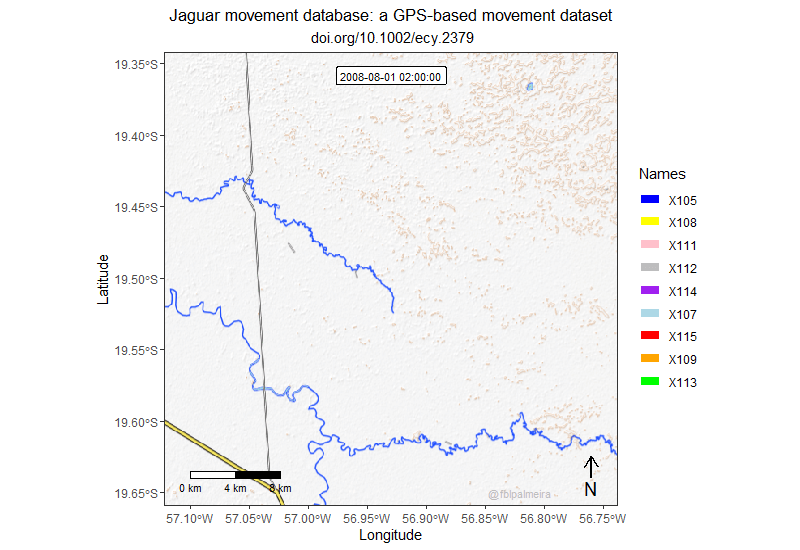

# Jaguar movevis

An animation showing the movement of nine individuals of jaguar which were tracked at the same time in the Brazilian Pantanal wetland using "Jaguar Movement Database" [(Morato el al 2018)](http://doi.org/10.1002/ecy.2379). 

- [Script `.R`](https://github.com/fblpalmeira/movevis/blob/main/data/jaguar_pantanal_saobento_2008.R)

- [Database `.csv`](https://github.com/fblpalmeira/movevis/blob/main/jaguar_pantanal_saobento_2008.txt)

References: 

[Morato, R. G. et al. 2018.](http://doi.org/10.1002/ecy.2379) Jaguar movement database: a GPS-based movement dataset of an apex predator in the Neotropics. Ecology.

[Schwalb-Willmann, J. 2020.](https://cran.r-project.org/web/packages/moveVis/index.html) Package 'moveVis': Movement Data Visualization.
